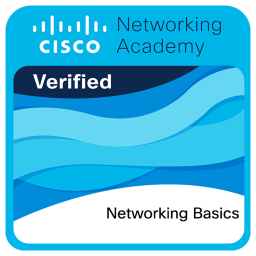

<h1 align="center">Alexandria Myers</h1>

<em>Aspiring IT Professional | Living and breathing technology</em>

---

## About Me
Hey, I’m Alexandria. I grew up in York, Pennsylvania and have been into computers since I was about 5 or 6 years old. IT isn’t just something I want to do for work — it’s something I enjoy in my free time too. I’ve worked with Cisco, Ubiquiti, Windows, Linux, Apple, and iOS devices. 

When I’m not doing schoolwork, I’m usually setting up phone systems, playing with Active Directory, writing some code here and there, or diving into open source projects. Outside of tech, I like being outdoors and anything motorized — cars, bikes, and just about anything I can tinker with or upgrade.

> I’m a transgender woman. Please respect my name and pronouns. I only use my legal/deadname for official purposes.

---

## Skills
- Cisco networking
- Ubiquiti hardware & networking
- Windows & Linux administration
- Apple & iOS device setup/support
- Active Directory
- PBX & CUCM setup
- Basic programming
- Open source advocacy

---

## Experience
I don’t have official work experience yet, but I’m looking for an entry-level IT job so I can start building that experience and grow my skills in a real work environment.

---

## Projects
**Enterprise CUCM Infrastructure – Lexleigh Technology Services**  
I set up a full Cisco Unified Communications Manager system for my own PBX business.

**Enterprise PBX for Home**  
Built a PBX system for my dad to save money on home phone service, integrated with our UniFi setup.

---

## Certifications

  
  
  

**CompTIA IT Fundamentals Certification ID:** `COMP001022646091`

---

## Education
**York County School of Technology** – Graduating 2027

---

## Contact
- **Email:** [qalexnadr1a@gmail.com](mailto:qalexnadr1a@gmail.com)  
- **Phone:** [570-520-5689](tel:5705205689)  
- **Location:** York, Pennsylvania  

---

© 2025 Alexandria Myers

